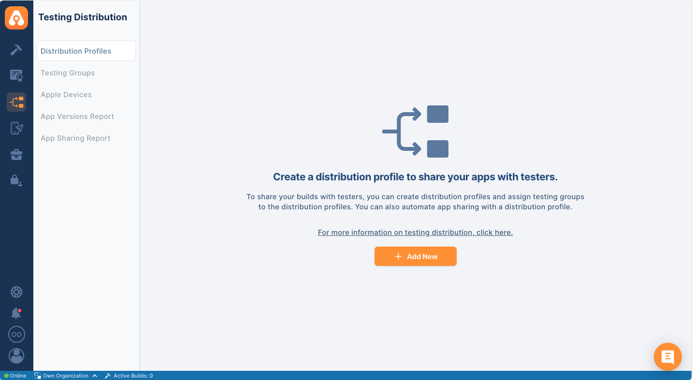
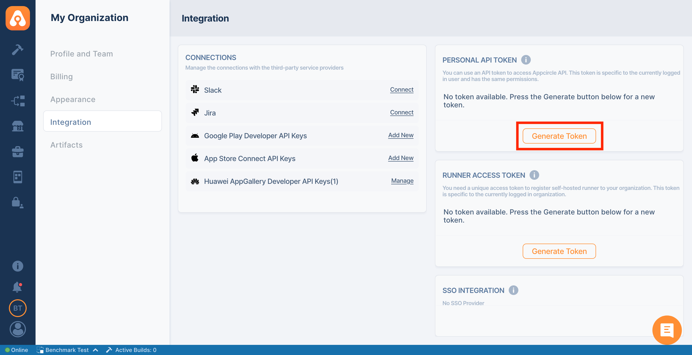

## Appcircle Testing Distribution

Appcircle simplifies the distribution of builds to test teams with an extensive platform for managing and tracking applications, versions, testers, and teams. Appcircle integrates with enterprise authentication mechanisms such as LDAP and SSO, ensuring secure distribution of testing packages. Learn more about Appcircle testing distribution. Learn more about [Appcircle testing distribution](https://appcircle.io/testing-distribution?&utm_source=azure&utm_medium=product&utm_campaign=testing_distribution)

Appcircle's test distribution extension enables developers to create test groups and share builds with them, utilizing enterprise-grade authentication methods. With the Visual Studio Extension, this module will be accessible directly from the Azure DevOps pipeline.

## Exploring Testing Distribution

Testing distribution is the process of distributing test builds to designated test groups or individuals. This process allows developers to gather quick feedback, identify bugs, and ensure the quality of software applications before releasing them to customers. Appcircle's test distribution module enables developers to create test groups and share builds with them, utilizing enterprise-grade authentication methods.

## Benefits of Using Testing Distribution

1. **Simplified Binary Distribution**.
   - **Skip Traditional Stores:** Share .xcarchive .IPA, APK, AAB, Zip, files directly, avoiding the need to use App Store TestFlight or Google Play Internal Testing.
2. **Streamlined Workflow:**
   - **Automated Processes:** Platforms like Appcircle automate the distribution process, saving time and reducing manual effort.
   - **Seamless Integration:** Integrates smoothly with existing DevOps pipelines, enabling efficient build and distribution workflows.
3. **Enhanced Security:**
   - **Controlled Access:** Set specific permissions for who can access the test builds using enterprise authentication methods such as LDAP & SSO.
   - **Confidentiality:** Ensures that only authorized testers have access to the builds, protecting sensitive information.
4. **Efficient Resource Management:**
   - **Targeted Testing:** Allows the creation of specific test groups, ensuring that the right people are testing the right features.
   - **Optimized Testing:** Helps in allocating resources effectively, leading to better utilization of testing resources.
5. **Reduced Time to Market:**
   - **Eliminates Approval Delays:** By bypassing store approval processes, developers can distribute builds directly to testers, speeding up the testing cycle.
   - **Continuous Delivery:** Supports continuous delivery practices, enabling faster iterations and quicker releases.
6. **Faster Feedback Loop:**
   - **Quick Issue Identification:** Distributing test builds quickly allows developers to gather immediate feedback, identify bugs, and address issues early in the development cycle.
   - **Improved Quality:** Continuous testing helps ensure the software meets quality standards before release, reducing the likelihood of post-release issues.
7. **Cost-Effective:**
   - **Reduced Overheads:** Automating the distribution reduces the need for manual intervention, cutting down operational costs.
   - **Efficient Bug Fixes:** Early detection and fixing of bugs prevent costly fixes later in the development process.
8. **Enhanced User Experience:**
   - **Better Quality Control:** Ensures that end users receive a more stable and polished product.
   - **Customer Satisfaction:** By delivering higher quality software, customer satisfaction and trust in the product increase.

Overall, using testing distribution in mobile DevOps significantly enhances the efficiency, security, and effectiveness of the software development process, leading to better products and faster delivery times.

<!-- ### Testing Distribution

In order to share your builds with testers, you can create distribution profiles and assign testing groups to the distribution profiles.



### Generating/Managing the Personal API Tokens

To generate a Personal API Token, follow these steps:

1. Go to the My Organization screen (the second option at the bottom left).
2. You'll find the Personal API Token section in the top right corner.
3. Press the "Generate Token" button to generate your first token.

 -->

```yaml
- task: AppcircleTestingDistribution@0
  inputs:
    personalAPIToken: $(AC_PERSONAL_API_TOKEN)
    authEndpoint: $(AC_AUTH_ENDPOINT)
    apiEndpoint: $(AC_API_ENDPOINT)
    profileName: $(AC_PROFILE_NAME)
    createProfileIfNotExists: $(AC_CREATE_PROFILE_IF_NOT_EXISTS)
    appPath: $(AC_APP_PATH)
    message: $(AC_MESSAGE)
```

- `personalAPIToken`: The Appcircle Personal API token used to authenticate and authorize access to Appcircle services within this extension.
- `authEndpoint` (optional): Authentication endpoint URL for self-hosted Appcircle installations. Defaults to https://auth.appcircle.io.
- `apiEndpoint` (optional): API endpoint URL for self-hosted Appcircle installations. Defaults to https://api.appcircle.io.
- `profileName`: Specifies the profile that will be used for uploading the app.
- `createProfileIfNotExists` (optional): Ensures that a testing distribution profile is automatically created if it does not already exist; if the profile name already exists, the app will be uploaded to that existing profile instead.
- `appPath`: Indicates the file path to the application package that will be uploaded to Appcircle Testing Distribution Profile.
- `message`: Your message to testers, ensuring they receive important updates and information regarding the application.

## Further Details

For more information please refer to the documentation.

- [Setting Up Appcircle Testing Distribution Task in Azure DevOps Pipeline](https://docs.appcircle.io/marketplace/visual-studio-marketplace/testing-distribution)
  - [Discover Extension]()
  - [System Requirements]()
  - [How to Add the Appcircle Testing Distribution Task to Your Pipeline]()
  - [Leveraging Environment Variables]()
- [References]()
